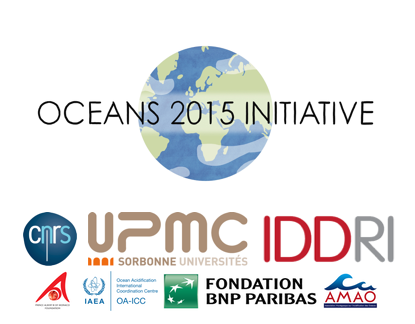

```{r setup, include=FALSE}
knitr::opts_chunk$set(echo = FALSE)
```



The Oceans 2015 Initiative was launched to provide COP21 negotiators with key information on how the future ocean will look like. It is led by CNRS-UPMC and IDDRI and is supported by the Prince Albert II of Monaco Foundation, the Ocean Acidification International Coordination Centre of the International Atomic Energy Agency, the BNP Paribas Foundation and the Monaco Association for Ocean Acidification. Key products of this initiative are available for scientists, decision makers and the general public.

<ul>
  <li><b>Scientific community</b></li>
  <ul>
<li>Gattuso J.-P., 2016. An ocean scientist at COP21. <i>Limnology and Oceanography Bulletin</i> 25:15-17. [<a href="http://dx.doi.org/10.1002/lob.10087" target="_blank">Link</a>] [<a href="files/Gattuso_2016_Limnology and Oceanography Bulletin" target="_blank">pdf</a>]</li>

<li>Gattuso J.-P., Magnan A., Bill&eacute; R., Cheung W. W. L., Howes E. L., Joos F., Allemand D., Bopp L., Cooley S., Eakin C. M., Hoegh-Guldberg O., Kelly R. P., P&ouml;rtner H.-O., Rogers A. D., Baxter J. M., Laffoley D., Osborn D., Rankovic A., Rochette J., Sumaila U. R., Treyer S. &amp; Turley C., 2015. Contrasting futures for ocean and society from different anthropogenic CO<sub>2</sub> emissions scenarios. <i>Science</i> 349: aac4722. [<a href="http://www.obs-vlfr.fr/~gattuso/science_reprint.php" target="_blank">Link</a>]</li>

<li>Howes E. L., Joos F., Eakin M. &amp; Gattuso J.-P., 2015. The Oceans 2015 Initiative, Part I: An updated understanding of the observed and projected impacts of ocean warming and acidification on physical and biological processes in the oceans. <i>IDDRI Study</i> 02/15:1-51. [<a href="http://www.iddri.org/Publications/The-Oceans-2015-Initiative,Part-I-An-updated-synthesis-of-the-observed-and-projected-impacts-of-climate-change-on-physical-and" target="_blank">Link</a>]</li>

<li>Howes E. L., Joos F., Eakin C. M. &amp; Gattuso J.-P., 2015. An updated synthesis of the observed and projected impacts of climate change on the chemical, physical and biological processes in the oceans. <i>Frontiers in Marine Science</i> 2:36. [<a href="http://dx.doi.org/10.3389/fmars.2015.00036" target="_blank">Link</a>]</li>

<li>Magnan A. K., Colombier M., Bill&eacute; R., Hoegh-Guldberg O., Joos F., P&ouml;rtner H.-O., Waisman H., Spencer T. &amp; Gattuso J.-P., 2016. Implications of the Paris Agreement for the ocean. Nature Climate Change. [<a href="http://em.rdcu.be/wf/click?upn=KP7O1RED-2BlD0F9LDqGVeSNWrZ4ZZv4VNM5-2B-2BTSQAu2Y-3D_a0CozdHDIYk-2F-2FE-2BofPglZn-2FmtaVgg5-2FlVl2L8MEug-2BM-2FjJBjIrkfdFV5RoqLdsmusgUPQcYYs3rJC6WvEBDBhm0DwoKO1DCqTvPhmRagdAkCedJ12XZ7gB0Pdwn-2BosZzjdEN4ajIy4QCkOY3D4aXrtM-2FiQ1FHFFbxS3oUoUM-2BslA4UcL5j6PagdAuoXLS6IJg6u5nPNNK9oRlCGnepNhJsTXtCej-2FrGk5f0o9WYsQHk-3D" target="_blank">Link</a>]</li>

<li>Magnan A. K. &amp; Gattuso J.-P., 2016. The cascading effects of climate-related changes in the ocean. In: Laffoley D. &amp; Baxter J. M. (Eds.), Explaining ocean warming: causes, scale, effects and consequences, pp. 47-54. Gland, Switzerland: IUCN. [<a href="https://portals.iucn.org/library/node/46254" target="_blank">Web page</a>] [<a href="files/Magnan_Gattuso_2016.pdf" target="_blank">pdf</a>].</li>

<li>Weatherdon L., Rogers A., Sumaila R., Magnan A. & Cheung W. W. L., 2015. The Oceans 2015 Initiative, Part II: An updated understanding of the observed and projected impacts of ocean warming and acidification on marine and coastal socioeconomic activities/sectors. <i>IDDRI Study</i> 03/15:1-44. [<a href="http://www.iddri.org/Publications/The-Oceans-2015-Initiative,Part-II-An-updated-understanding-of-the-observed-and-projected-impacts-of-ocean-warming-and-acidific" target="_blank">Link</a>]</li>

<li>Weatherdon L. W., Magnan A. K., Rogers A. D., Sumaila U. R. &amp; Cheung W. W., 2016. Observed and projected impacts of climate change on marine fisheries, aquaculture, coastal tourism, and human health: an update. <i>Frontiers in Marine Science</i> 3:48. [<a href="http://dx.doi.org/10.3389/fmars.2016.00048" target="_blank">Link</a>]</li>

</ul>


<li><b>Decision makers: policy briefs</b></li>
	<ul>
		Magnan A. K., Bill&eacute; R., Cooley S. R., Kelly R., P&ouml;rtner H.-O., Turley C. &amp; Gattuso J.-P., 2015. Intertwined ocean and climate: implications for international climate negotiations. <i>IDDRI Policy Brief</i> 04/15:1-4.
		<a href="http://bit.ly/2NCAY9Q" target="_blank">English</a>, <a href="files/Magnan_et_al._oceans_and_climate-FR.pdf" target="_blank">French</a>, <a href="files/Magnan_et_al._oceans_and_climate-SP.pdf" target="_blank">Spanish</a> and <a href="files/Magnan_et_al._oceans_and_climate-CN.pdf" target="_blank">Chinese</a></li>
			
<li>Magnan A. K. &amp; Gattuso J.-P., 2016. Contrasting futures for ocean and society from slow-onset climate-related changes. 8th meeting of the Research Dialogue (D8), SBSTA 44, UNFCCC, Bonn. [<a href="http://unfccc.int/science/workstreams/research/items/9475.php" target="_blank">Link</a>]</li>

</ul>


<li><b>General public</b></li>

<ul>
	<li>Popular articles</li>
	<ul>
		<li>Allemand D., 2015. L'Oc&eacute;an, oublié de la COP21 ? <i>La Gazette de Monaco</i> 493:64-65. [<a href="http://www.centrescientifique.mc/fr/actualites/180-La-Gazette-de-Monaco-Septembre-2015.html" target="_blank">Link</a>]</li>
		<li>Bopp L., Magnan A. &amp; Gattuso J.-P., 2015. Oc&eacute;ans et climat : un duo ins&eacute;parable. <i>Dossier Pour la Science</i> 89:34-40. [<a href="http://www.pourlascience.fr/ewb_pages/a/article-rechauffement-climatique-les-oceans-menaces-de-toute-part-35969.php" target="_blank">Link</a>]</li>
		<li>Gattuso J.-P. &amp; Magnan A., 2015. Les oc&eacute;ans, acteurs et victimes du changement climatique. <i>Le Monde Diplomatique</i> No spécial Novembre:i et iv. [<a href="http://www.monde-diplomatique.fr/2015/11/GATTUSO/54182 " target="_blank">Link</a>] [<a href="files/Gattuso_Magnan_2015_Le Monde Diplomatique.pdf" target="_blank">pdf</a>]</li>
		<li>Gattuso J.-P. & Magnan A., 2015. Climate debate overlooks our oceans: global warming actors and victims. Le Monde Diplomatique UK edition Special Issue December:I-IV. [<a href="http://mondediplo.com/2015/12/16oceanssupp" target="_blank">Link</a>] [<a href="files/Gattuso_Magnan_2015_Le Monde Diplomatique UK edition.pdf" target="_blank">pdf</a>]</li>
		
<li>Gattuso J.-P. &amp; Magnan A., 2015. L&rsquo;oc&eacute;an, acteur et victime du changement climatique. In: Etienne J. &amp; Gabri&eacute; C. (Eds.), Les &eacute;cosyst&egrave;mes marins dans la r&eacute;gulation du climat, pp. 46-47. Paris: Fonds Fran&ccedil;ais pour l'Environnement Mondial. [<a href="http://www.ffem.fr/accueil-FFEM/publications/Publications-geographiques-sectorielles-et-thematiques?actuCtnId=134984" target="_blank">Link</a>] [<a href="files/Gattuso_Magnan_2015.pdf" target="_blank">pdf</a>]</li>
		
		<li>Gattuso J.-P. & Magnan A., 2016. What does the Paris Agreement mean for the oceans? Carbon Brief. [Published 2016; Accessed: 2016-09-28] [<a href="https://www.carbonbrief.org/guest-post-what-does-the-paris-agreement-mean-for-oceans" target="_blank">link</a>].</li>
		
		<li>Magnan A. &amp; Gattuso J.-P., 2015. L'oc&eacute;an, acteur oubli&eacute; du réchauffement global. <i>Alternatives Internationales</i> hors s&eacute;rie 17:14-15. [<a href="http://www.alternatives-internationales.fr/l-ocean--acteur-oublie-du-rechauffement-global_fr_art_1398_74102.html " target="_blank">Link</a>] [<a href="files/Magnan_Gattuso_2015_Alternatives_Internationales.pdf" target="_blank">pdf</a>]</li>
		
		<li>Magnan A. K. &amp; Gattuso J.-P., 2015. Explorer le futur des oc&eacute;ans pour agir maintenant sur le changement climatique. <i>The Conversation</i> Novembre 2015. [<a href="https://theconversation.com/explorer-le-futur-des-oceans-pour-agir-maintenant-sur-le-changement-climatique-49557" target="_blank">Link</a>]</li> 
		
		<li>Ribera T., Rochette J. &amp; Magnan A., 2015. Oc&eacute;ans : en quête de règles internationales. <i>Le Monde Diplomatique</i> No spécial Novembre: iv. [<a href="http://www.monde-diplomatique.fr/2015/11/MAGNAN/54186" target="_blank">Link</a>]</li> 
	</ul>
	
	<li>Animated movie</li>
	<ul>
		<li><a href="https://youtu.be/dsncyks_nkE" target="_blank">French version</a></li>
		<li><a href="https://youtu.be/1wu_ep71-qU" target="_blank">English version</a></li>
		<li><a href="https://youtu.be/mQeZHjYkwyc" target="_blank">English version subtitled in Spanish</a></li>
		<li><a href="https://youtu.be/9pH4NEoG3Ic" target="_blank">English version subtitled in Chinese</a> [<a href="https://vimeo.com/131199233" target="_blank">other link</a>]</li>
		<li><a href="http://v.qq.com/page/f/x/n/f0170l8ejxn.html" target="_blank">French version subtitled in Chinese</a></li>		
		<li><a href="https://youtu.be/EP7ywOmzCjM" target="_blank">English version subtitled in Arabic</a></li>
	</ul>

  <li><a href="http://lavventura.blog.lemonde.fr/2014/12/19/une-histoire-dacidite-doeufs-durs-et-de-maquereaux-sur-la-cote-dazur/" target="_blank">Cartoon</a></li>
</ul>

  <li><b><a href="https://docs.google.com/document/d/1ulBtwdN9rxuRYwIXBUOAkcaJbM1wTQalmXeskV-n3vs/edit?usp=sharing" target="_blank">Media</a></b></li>
	<ul>
		<li>Press releases</li>
		<ul>
			<li><a href="files/2015-07_ocean_2015_cp_english.pdf" target="_blank">English version</a></li>
			<li><a href="files/2015-07_ocean_2015_cp_french.pdf" target="_blank">French version</a></li>
	</ul>

		<li><a href="https://docs.google.com/document/d/1ulBtwdN9rxuRYwIXBUOAkcaJbM1wTQalmXeskV-n3vs/edit?usp=sharing" target="_blank">Media coverage</a></li>
	</ul>


</ul>
