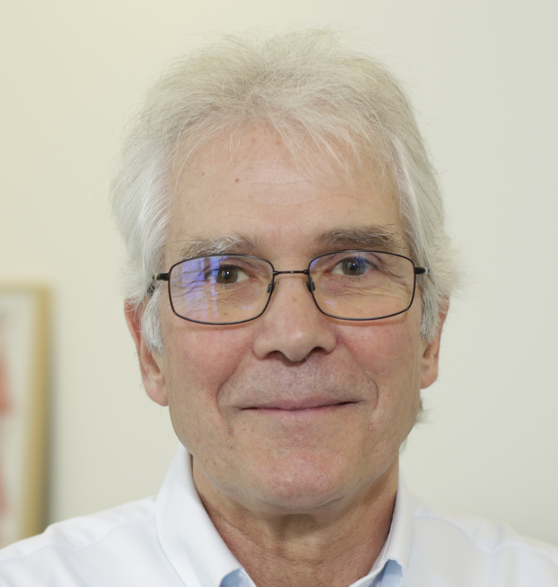

```{r setup, include=FALSE}
knitr::opts_chunk$set(echo = FALSE)
```

{width=30%}

CNRS-Sorbonne Université<br>
Laboratoire d'Océanographie<br>
181 Chemin du Lazaret<br>
06230 Villefranche-sur-mer<br>
France<br>

Tel: +33 (0)493 763859<br>
Fax: +33 (0)493 763834<br>
e-mail: jean-pierre.gattuso (at) imev-mer.fr<br>

I am CNRS Research Professor at the Laboratoire d'Océanographie de Villefranche (Sorbonne University) and Associate Scientist at the Institute for Sustainable Development and International Relations (IDDRI-SciencesPo, Paris). My current research relates to the effects of ocean acidification and warming on marine ecosystems and the services that they provide to society. I also investigate ocean-based solutions to mitigate and adapt to climate change. I had the opportunity to lead the launch of the Ocean Acidification International Coordination Centre at the International Atomic Energy Agency. I coedited the first book on ocean acidification (Oxford University Press) and chair the initiative of Prince Albert II of Monaco Foundation "Ocean Acidification and other ocean Changes – Impacts and Solutions" (OACIS). I contributed to several IPCC products (AR5, Special Report on 1.5°C of Warming, and the Special Report on the Ocean and Cryosphere). I had the honor to receive the Vladimir Vernadsky medal of the European Geosciences Union, the Blaise Pascal medal of the European Academy of Sciences, and the Ruth Patrick Award of the Association for the Sciences of Limnology and Oceanography. I am an elected member of the European Academy of Sciences and Academia Europaea. More information is available [here](cv.html).

_Je suis directeur de recherche au CNRS et travaille au laboratoire d'océanographie de Villefranche (Sorbonne Université). Je suis également chercheur associé à Institut du développement durable et des relations internationales (IDDRI-Sciences Po). Mes recherches actuelles concernent les effets du réchauffement et de l'acidification des océans sur les écosystèmes marins et les services écosystémiques. J'étudie également les solutions basées sur l’océan qui permettent de réduire et de s’adapter au changement climatique. J'ai pu conduire le lancement du Centre international de coordination des recherches sur l'acidification des océans de l’Agence internationale de l’énergie atomique. J'ai co-édité le premier ouvrage sur cette question (Oxford University Press) et préside l’initiative de la Fondation Prince Albert II de Monaco "Ocean Acidification and other ocean Changes – Impacts and Solutions" (OACIS). J'ai eu la chance de pouvoir contribuer à plusieurs rapports du Groupe d’experts intergouvernemental sur l’évolution du climat (GIEC). J'ai eu l'honneur de recevoir la médaille Vladimir Vernadsky de l’European Geosciences Union, la médaille Blaise Pascal de l'Académie européenne des sciences et le prix Ruth Patrick de l’Association for the Sciences of Limnology and Oceanography. Membre élu de l’Académie européenne des sciences et de l’Academia Europaea. Plus d’information est disponible [ici](cv.html)._

