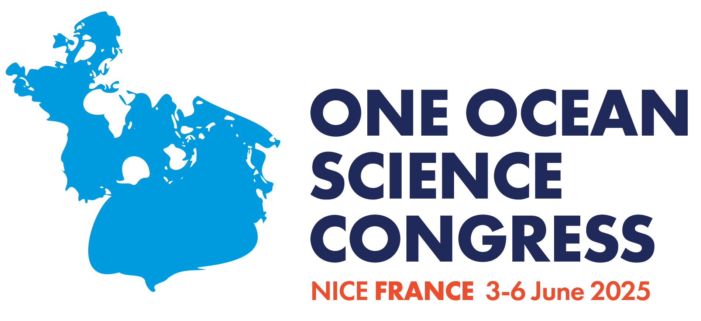

```{r setup, include=FALSE}
knitr::opts_chunk$set(echo = FALSE)
```

<!--  -->


<ul>
  <li><a href="https://doi.org/10.5281/zenodo.14361191"target="_blank">Recommendations to Heads of State and Government</a>.</li>
  <ul>
    <li><a href="https://doi.org/10.5281/zenodo.15505322"target="_blank">Executive Summary in Arabic</a>.</li>
   <li><a href="https://doi.org/10.5281/zenodo.15486287"target="_blank">Executive Summary in English</a>.</li>
    <li><a href="https://doi.org/10.5281/zenodo.15505338"target="_blank">Executive Summary in Chinese</a>.</li>
    <li><a href="https://doi.org/10.5281/zenodo.15505379"target="_blank">Executive Summary in Spanish</a>.</li>
    <li><a href="https://doi.org/10.5281/zenodo.15505389"target="_blank">Executive Summary in French</a>.</li>
    <li><a href="https://doi.org/10.5281/zenodo.15505408"target="_blank">Executive Summary in Russian</a>.</li>
    <li><a href="https://kdrive.infomaniak.com/app/share/209550/85038bcc-934b-430d-87d0-7aedd13f8973" target="_blank">Infographic</a></li>
    </ul>
    
  <li><a href="https://doi.org/10.5281/zenodo.14649769"target="_blank">Urgent Call for Coral Reefs</a>.</li>
  <li><a href="https://doi.org/10.5281/zenodo.15533851"target="_blank">Policy brief: Knowledge for a Thriving Ocean, published by IDDRI and the Jacques Delors Institute</a>.</li>
    <li><a href="https://kdrive.infomaniak.com/app/share/209550/53d3d2ab-d904-4724-9740-33422d72d8b2" target="_blank">OOSC Manifesto to UNOC3 delegates</a></li>
    <li><a href="https://doi.org/10.1038/s41559-025-02750-3"target="_blank">Correspondence: 'US federal cuts threaten international science and diplomacy', published in Nature Ecology & Evolution</a>.</li>
</ul>
