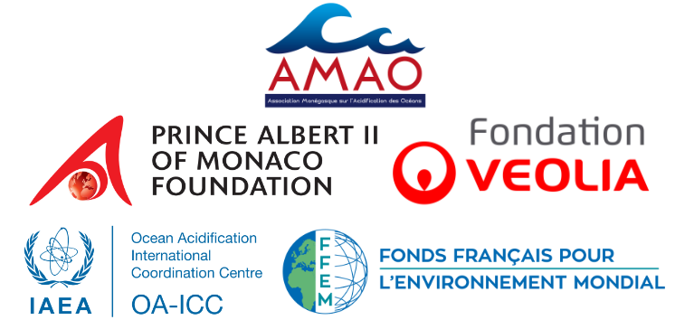

```{r setup, include=FALSE}
knitr::opts_chunk$set(echo = FALSE)
```



<p>Climate change already affects marine and coastal ecosystems and ecosystem services. Risk levels strongly depend on future rates of greenhouse gas emissions and even a global surface warming of between 1.5-2.0°C by the end of the century compared to pre-industrial levels, consistent with the Paris Agreement, will generate serious impacts on the ocean. Hence there is urgent need for ambitious global mitigation and local adaptation, and for assessing the possible contribution of the ocean to the leeway for action.</p>

<p>The Ocean Solutions Initiative was launched to assess the potential of ocean-based measures to reduce changes in three major climate-related drivers (ocean warming, ocean acidification, and sea-level rise) both globally and/or locally, as well as to reduce adverse impacts on vital climate-sensitive ecosystems (coral reefs, mangroves and salt marshes, seagrass beds, and Arctic biota) and ecosystem services (fin fisheries, fish aquaculture, coastal protection, and bivalve fisheries and aquaculture).</p>

<p>This web page lists the products of The Ocean Solutions Initiative</p>

### Participants

<ul>
  <li> Billé, Raphaël, The Pacific Community, New Caledonia
  <li> Bopp, Laurent, CNRS, France
  <li> Cheung, William, University of British Columbia, Canada
  <li> Duarte, Carlos, King Abdullah University of Science and Technology, Saudi Arabia
  <li> Gates, Ruth, University of Hawaii, USA
  <li> Gattuso, Jean-Pierre, CNRS, Sorbonne Université and IDDRI, France
  <li> Hinkel, Jochen, Global Climate Forum, Germany
  <li> Magnan, Alexandre, Institut du développement durable et des relations internationales, France
  <li> Mcleod, Elizabeth, The Ocean Conservancy, USA
  <li> Micheli, Fiorenza, Center for Ocean Solutions, Stanford University, USA
  <li> Middelburg, Jack, University of Utrecht, The Netherlands
  <li> Oschlies, Andreas, GEOMAR, Germany
  <li> Hans-Otto Pörtner, Alfred Wegener Institute for Polar and Marine Research
  <li> Rau, Gregg, University of California at Santa Cruz, USA
  <li> Williamson, Phil	University of East Anglia, United Kingdom
</ul>

Vanesa Chalastani and Jean-Olivier Irisson also contributed.


### Support

The Ocean Solutions Initiative is coordinated by the <a href="https://www.fpa2.org/amao-en.html" target="_blank">Monaco Association on Ocean Acidification</a>. We are grateful for the support of the <a href="http://www.fpa2.org/home.html" target="_blank">Prince Albert II of Monaco Foundation</a>, the <a href="https://fondation.veolia.com/en" target="_blank">Veolia Foundation</a>, the <a href="https://www.iaea.org/ocean-acidification/page.php?page=2181" target="_blank">Ocean Acidification International Coordination Centre</a> and the <a href="https://www.ffem.fr/en" target="_blank">French Facility for Global Environment</a>.

### Publications

<ul>

<li>Albright R., Hansson L., Cooley S., Gattuso J.-P., Marshall P., Marshal N., Fletcher S., Haraldsson G. & Hoegh-Guldberg O., July 2021. Are we ready for ocean acidification? A framework for assessing and advancing policy readiness. <i>Science Advances</i>. 

<li>Cziesielski M. J., Duarte C. M., Aalismail N. A., Al-Hafedh Y., Anton A., Faiyah Baalkhuyur F., Baker A. C., Balke T., Baums I. B., Berumen M. L., Chalastani V. I., Cornwell B., Daffonchio D., Diele K., Ehtsaam F., Gattuso J.-P., He S., Lovelock C., Mcleod E., Macreadie P. I., Marba N., Martin C., Muniz Barreto M., Krishnakumar P. K., Prihartato P., Rabaoui L., Saderne S., Schmidt-Roach S., Suggett D., Sweet M., Statton J., Teicher S., Trevathan-Tackett S. M., Joydas T. V., Yahya R. Z. &amp; Aranda M., 2021. Investing in Blue Natural Capital to secure a future for the Red Sea ecosystems. <i>Frontiers in Marine Science</i> 7:603722.  [<a href="https://doi.org/10.3389/fmars.2020.603722" target="_blank">link</a>]</i>

<li>Cramer W., Guiot J., Fader M., Garrabou J., Gattuso J.-P., Iglesias A., Lange M. A., Lionello P., Llasat M. C., Paz S., Pe&ntilde;uelas J., Snoussi M., Toreti A., Tsimplis M. N. &amp; Xoplaki E., 2018. Climate change and interconnected risks to sustainable development in the Mediterranean. <i>Nature Climate Change</i> 8:972–980. [<a href="https://doi.org/10.1038/s41558-018-0299-2" target="_blank">Abstract</a>]</li>

<li>Duarte C. M., Agust&iacute; S., Barbier E., Britten G. L., Castilla J. C., Gattuso J.-P., Fulweiler R. W., Hughes T. P., Knowlton N., Lovelock C. E., Lotze H. K., Predragovic M., Poloczanska E., Roberts C. &amp; Worm B., 2020. Rebuilding marine life. <i>Nature</i> 580:39-51. [<a href="https://doi.org/10.1038/s41586-020-2146-7" target="_blank">link</a>]</li>

<li>Duarte C. M., Gattuso J.-P., Hancke K., Gundersen H., Filbee-Dexter K., Pedersen M. F., Middelburg J. J., Burrows M. T., Krumhansl K. A., Wernberg T., Moore P., Pessarrodona A., Bachmann Ørberg S., Pinto I. S., Assis J., Queirós A. M., Smale D. A., Bekkby T., Serrão E. A. & Krause-Jensen D., 2022 Global estimates of the extent and production of macroalgal forests. <i>Global Ecology and Biogeography</i> [<a href="https://doi.org/10.1111/geb.13515" target="_blank">link</a>]</li>

<li>Duvat V. K. E., Magnan A. K., Perry C. T., Spencer T., Bell J. D., Wabnitz C., Webb A. P., White I., McInness K. L., Gattuso J.-P., Graham N. A. J., Nunn P. D. &amp; Le Cozannet G., 2021. Risks to future atoll habitability from climate-driven environmental changes. <i>WIREs Climate Change</i>: e700. [<a href="https://doi.org/10.1002/wcc.700" target="_blank">link</a>]

<li>Galgani F., Le Bris N. &amp; Gattuso J.-P., 2017. <i>Introduction</i>. In: Euzen A., Gaill F., Lacroix S. & Cury P. (Eds.), The ocean revealed, pp. 217. Paris: CNRS Editions.</li>

<li>Gattuso J.-P., Gentili B., Antoine D. &amp; Doxaran D., 2020. Global distribution of photosynthetically available radiation on the seafloor. <i>Earth System Science Data</i> 12:1697-1709. [<a href="https://doi.org/10.5194/essd-12-1697-2020" target="_blank">link</a>]</li>

<li>Gattuso J.-P. &amp; Hansson L., 2017. <i>Ocean acidification</i>. In: Euzen A., Gaill F., Lacroix S. &amp; Cury P. (Eds.), The ocean revealed, pp. 66-67. Paris: CNRS Editions.</li>

<li>Gattuso J.-P. &amp; Magnan A., 2017. <i>Risks related to climate change</i>. In: Euzen A., Gaill F., Lacroix S. &amp; Cury P. (Eds.), The ocean revealed, pp. 220-221. Paris: CNRS Editions.</li>

<li>Gattuso J.-P., Magnan A. K., Bopp L., Cheung W. W. L., Duarte C. M., Hinkel J., Mcleod E., Micheli F., Oschlies A., Williamson P., Billé R., Chalastani V. I., Gates R. D., Irisson J.-O., Middelburg J. J., P&ouml;rtner H.-O. &amp; Rau G. H., 2018. Ocean solutions to address climate change and its effects on marine ecosystems . <i>Frontiers in Marine Science</i> 5:337. [<a href="https://doi.org/10.3389/fmars.2018.00337" target="_blank">link</a>][<a href="https://www.frontiersin.org/articles/10.3389/fmars.2018.00337/full#supplementary-material" target="_blank">supplementary material</a>]</li> 

<li>Gattuso J.-P., Magnan A. K., Duarte C. &amp; Williamson P., 2021 The potential for ocean-based climate action: negative emissions technologies and beyond. <i>Frontiers in Climate</i> 2:575716. [<a href="https://doi.org/10.3389/fclim.2020.575716" target="_blank">link</a>]</li>

<li>Gattuso J.-P., Magnan A. K., Gallo N., Herr D., Rochette J., Vallejo L. &amp; Williamson P., 2019. Opportunities for increasing ocean action in climate strategies. <i>Iddri Policy Brief</i> 02/19:1-4. [<a href="http://bit.ly/2NswD9t" target="_blank">link</a>][<a href="supplementary_Material_policy_brief_2019.pdf" target="_blank">supplementary material</a>]</li>

<li>Gattuso J.-P. & Jiao N., 2022. Ocean-based climate actions recommended by academicians from Europe and China. <i>SCIENCE CHINA Earth Sciences</i>. [<a href="https://www.sciengine.com/SCES/doi/10.1007/s11430-022-9970-0" target="_blank">Abstract</a>][<a href="https://www.sciengine.com/SCES/home" target="_blank">Journal home page</a>].</li>

<li>Gattuso J.-P., Jiao N., Chen F., Jouzel J., Le Quéré C., Lu Y., Tréguer P., von Schuckmann K., Wang Z. L. & Zang J., 2022. Ocean-based climate action. 12 p. Beijing and Brussels: Chinese Academy of Sciences and European Academy of Sciences. [<a href="https://doi.org/10.5281/zenodo.6410659" target="_blank">Report</a>]</li>

<li>Kleypas J., Allemand D., Anthony K., Baker A. C., Beck M., Hale L. Z., Hilmi N., Hoegh-Guldberg O., Hughes T., Kaufman L., Kayanne H., Magnan A., Mcleod E., Mumby P., Palumbi S., Richmond R., Rinkevich B., Steneck R. S., Voolstra C. R., Wachenfeld D. &amp; Gattuso J.-P., 2021 Designing a blueprint for coral reef survival. <i>Biological Conservation</i> 257:109107.</i> [<a href="https://doi.org/10.1016/j.biocon.2021.109107" target="_blank">link</a>]</li>

<li>Magnan A. K., Billé R., Bopp L., Chalastani V. I., Cheung W. W. L., Duarte C. M., Gates R. D., Hinkel J., Irisson J.-O., Mcleod E., Micheli F., Middelburg J. J., Oschlies A., P&ouml;rtner H.-O., Rau G. H., Williamson P. &amp; Gattuso J.-P., 2018. Ocean-based measures for climate action. IDRRI Policy Brief 6:1-4. [<a href="http://bit.ly/2OwiQjJ" target="_blank">link</a>]</li>

<li>Magnan A. K., Billé R., Bopp L., Chalastani V. I., Cheung W. W. L., Duarte C. M., Gates R. D., Hinkel J., Irisson J.-O., Mcleod E., Micheli F., Middelburg J. J., Oschlies A., P&ouml;rtner H.-O., Rau G. H., Williamson P. &amp; Gattuso J.-P., 2018. Le rôle potentiel de l’océan dans l’action climatique. Propositions 6:1-4. [<a href="http://bit.ly/2P8KFi5" target="_blank">link</a>]</li>

<li>Magnan A. K. &amp; Gattuso J.-P., 2016. <i>The cascading effects of climate-related changes in the ocean</i>. In: Laffoley D. &amp; Baxter J. M. (Eds.), Explaining ocean warming: causes, scale, effects and consequences, pp. 47-54. Gland, Switzerland: IUCN.</li>

<li>Magnan A. K. &amp; Gattuso J.-P., 2016. The need for fighting against ocean change. <i>Ocean Newsletter</i> 393.</li>

<li>Magnan A. K., Pörtner H.-O., Duvat V. K. E., Garschagen M., Guinder V. A., Hoegh Guldberg O., Zommers Z. & Gattuso J.-P., 2021 Estimating the global aggregated risk of anthropogenic climate change. <i>Nature Climate Change</i>. [<a href="https://doi.org/10.1038/s41558-021-01156-w" target="_blank">link</a>].

<li>Masson-Delmotte V. &amp; Gattuso J.-P., 2017. <i>The ocean in IPCC reports</i>. In: Euzen A., Gaill F., Lacroix S. &amp; Cury P. (Eds.), The ocean revealed, pp. 258-259. Paris: CNRS Editions.</li>

<li>Rau G. H., Caldeira K., Gattuso J.-P., Greene C. H., Karl D. M., Leinen M., McNutt M. K., Murray J. W. &amp; von Herzen B., submitted. Carbon dioxide removal: size matters. <i>Science</i>, <a href="http://science.sciencemag.org/content/356/6339/706/tab-e-letters" target="_blank">http://science.sciencemag.org/content/356/6339/706/tab-e-letters</a>. (correspondence)</li>

<li>Williamson P. & Gattuso J.-P., 2022. Carbon removal using coastal blue carbon ecosystems is uncertain and unreliable, with questionable climatic cost-effectiveness. <i>Frontiers in Climate</i> 4. [<a href="https://doi.org/10.3389/fclim.2022.853666" target="_blank">Abstract</a>][<a href="https://www.frontiersin.org/journals/climate" target="_blank">Journal home page</a>].</li>

<li>Williamson P. & Gattuso J.-P., 2022. Pourquoi on ne peut pas se fier à la restauration des habitats côtiers pour ralentir le changement climatique. The Conversation. 
[<a href="https://theconversation.com/pourquoi-on-ne-peut-pas-se-fier-a-la-restauration-des-habitats-cotiers-pour-ralentir-le-changement-climatique-187788" target="_blank">Web article</a>]</li>

<li>Williamson P. & Gattuso J.-P., 2022. Climate change: why we can’t rely on regrowing coastal habitats to offset carbon emissions. The Conversation. 
[<a href="https://theconversation.com/climate-change-why-we-cant-rely-on-regrowing-coastal-habitats-to-offset-carbon-emissions-185726" target="_blank">Web article</a>]</li>

</ul>


### Presentations at meetings and seminars
	
<ul>
	<li>Gattuso J.-P., January 2021. Ocean-based measures to reduce climate change and its impacts, Utrecht University colloquium series Hot Topics in Climate. <a href="https://www.uu.nl/en/events/colloquium-hot-topics-jean-pierre-gattuso" target="_blank">Video</a>.  </li>
	<li>Gattuso J.-P. & Duarte C.M., June 2020. Rebuilding marine biodiversity. Iddri-Sciences Po webinar. <a href="https://youtu.be/jLIi-umt-_4" target="_blank">Video</a>.  </li>
	<li>Gattuso J.-P., June 2020. Le climat et l’océan, indissociablement liés. L’Ifremer met l’océan à l’honneur. <a href="https://wwz.ifremer.fr/Actualites-et-Agenda/Toutes-les-actualites/L-Ocean-a-l-honneur-avec-des-personnalites-de-la-mer-et-des-chercheurs-des-3-oceans" target="_blank">Video</a>.  </li>
	<li>Gattuso J.-P., April 2020. The Ocean: an actor and a victim of climate change but also a source of solutions. EU’s International Ocean Governance Forum. <a href="https://youtu.be/_RGninKVDzE?t=5545" target="_blank">Video</a>.  </li>
	<li>Gattuso J.-P., March 2020. Opportunities for increasing ocean action in climate strategies. G20 meeting, Ryadh.</li>
	<li>Gattuso J.-P., February 2020. Conséquences des récents rapports du GIEC pour la mer Méditerranée et la montagne. Conseil départemental des Alpes-Maritimes, Nice.</li>
	<li>Gattuso J.-P., January 2020. L'océan : acteur-clé du climat, victime du changement climatique, mais source de solutions. Task force Océan, CNRS, Paris.</li>
	<li>Gattuso J.-P., January 2020. L’océan de l'Anthropocène. Académie des Sciences, Paris. <a href="https://youtu.be/ztwiJdgPWrk" target="_blank">Video</a>.  </li>
	<li>Gattuso J.-P., December 2019. Ocean-based solutions. Japan Pavilion, COP25, Madrid.</li>
	<li>Gattuso J.-P., December 2019. Opportunities for increasing ocean action in climate strategies. EU Pavilion, COP25, Madrid.</li>
	<li>Gattuso J.-P., December 2019. Opportunities for increasing ocean action in climate strategies. French Pavilion, COP25, Madrid.</li>
	<li>Gattuso J.-P., December 2019. Ocean-based mitigation and adaptation. IPCC Pavilion, COP25, Madrid.</li>
	<li>Gattuso J.-P., December 2019. Ocean in the climate system & SROCC conclusions. French Pavilion, COP25, Madrid.</li>
	<li>Gattuso J.-P., October 2019. IPCC Special Report on Ocean and Cryosphere in a Changing Climate (including ocean solutions). Ocean and Climate Nexus: Road to COP25, Chilean Embassy, Paris.</li>
	<li>Gattuso J.-P., October 2019. IPCC Special Report on Ocean and Cryosphere in a Changing Climate and solutions). Entreprises pour l'environnement, Paris.</li>
	<li>Gattuso J.-P., October 2019. Ocean-based solutions. Marine Regions Forum, Berlin.</li>
	<li>Gattuso J.-P., August 2019. L’océan de l'Anthropocène. École d'été 2019 pour journalistes sur les sciences et technologies marines, Brest.</li>
	<li>Gattuso J.-P., June 2019. L’océan et le changement climatique : causes, impacts et solutions. L’Académie des sciences à Nice et à Sophia Antipolis, Nice.  <a href="https://public.weconext.eu/academie-sciences/2019-06-20/video_id_003/index.html" target="_blank">Video</a>.  </li>
	<li>Gattuso J.-P., April 2019. Pressions de l’homme sur la mer Méditerranée : état des lieux et solutions. Tables-rondes de l'Arbois, Marseille. </li>
	<li>Gattuso J.-P., March 2019. Acidification des océans : causes, conséquences et solutions. Acidification des océans : conséquences sur les écosystèmes et les activités humaines. Nantes, Ministère de l'environnement. </li>
	<li>Gattuso J.-P., March 2019. Climate change, coral reefs and mangroves: recent assessments of impacts, risks and solutions. Securing a future for Red Sea Ecosystems, Thuwal, Saudi Arabia. </li>
	<li>Gattuso J.-P., December 2018. État des connaissances sur les grands enjeux du changement climatique en milieu marin. Quel rôle de la science pour renforcer l’adaptation et l’atténuation au cœur des territoires?, Marseille. GREC-SUD.</li>
	<li>Gattuso J.-P., December 2018. Key global ocean drivers, impacts, and solutions. Seminar, University of Chicago.</li>
	<li>P&ouml;rtner H.-O., December 2018. Implications of the IPCC Special Report on Global Warming of 1.5 °C for Oceans and People. COP24, Katowice, Poland</li>
	<li>Pörtner H.-O., December 2018. Impacts of Ocean Acidification in a wider Context: Insights from IPCC SR15 and Current Research. COP24, Katowice, Poland</li>
	<li>Gattuso J.-P., December 2018. Global and local measures to reduce the risks of impact of climate change on coral reefs. General Assembly of the International Coral Reef Initiative, Monaco. </li>
	<li>Gattuso J.-P., July 2018. Key global ocean drivers, impacts, and solutions. 4th Geo Blue Planet Symposium, Toulouse. </li>
	<li>Williamson P., Oct. 2018. Keynote: Multi-faceted CO2 removal methods. Negative Emissions Conference 2018, Canberra.</li>
	<li>Gattuso J.-P., Nov. 2018. Key global ocean drivers, impacts, and solutions. Seminar, University of Chicago, USA. </li>
	<li>Gattuso J.-P., June 2018. Impact des changements climatiques : solutions globales et locales. Colloque “Récifs coralliens : des solutions pour aujourd’hui et demain”, Paris. </li>
	<li>Magnan A. K., 2018. Audition &agrave; l'Assemblée nationale par la mission d'information sur la gestion des événements climatiques majeurs dans les zones littorales de l’hexagone et des outre-mer.</li>
	<li>Gattuso J.-P., Nov. 2017. Ocean-based solutions to minimise impacts of climate-related changes. Side event "Fast-tracking and financing coastal and marine nature-based solutions for climate resilience", UNFCCC COP23, Bonn.</li>	
	<li>Gattuso J.-P., Nov. 2017. Ocean-based solutions to minimise impacts of climate-related changes. Workshop “From sciences to solutions: ocean acidification impacts on ecosystem services — case studies on coral reefs", Monaco.</li>	
	<li>Gattuso J.-P., Nov. 2017. Changements climatiques et océans : conséquences et solutions. 2e congrès de la Société Francophone de néphrologie, dialyse et transplantation, Nice.</li>	
	<li>Gattuso J.-P., Nov. 2017. Climate change and the ocean: consequences and solutions. Seminar at The Lyell Centre, Heriott-Watt University, Scotland.</li>		
	<li>Magnan A. K., Nov. 2017. Contrasting futures of climate change impacts on the ocean, and ocean-based solutions. Policy workshop Towards ocean-related NDCs, UNFCCC COP23, Bonn.</li>
		
</ul>


### Animated movies

<ul>
	<li><a href="files/OceanForClimate_EN.mp4" target="_blank">In English</a>
	<li><a href="files/OceanForClimate_ST_EN.mp4" target="_blank">In English subtitled in English</a>
	<li><a href="files/OceanForClimate_FR.mp4" target="_blank">In French</a>
	<li><a href="files/OceanForClimate_ST_FR.mp4" target="_blank">In French subtitled in French</a>
	<li><a href="files/OceanForClimate_ST_SP.mp4" target="_blank">In English subtitled in Spanish</a>
	<li><a href="files/OceanForClimate_ST_CHINA.mp4" target="_blank">In English subtitled in Chinese</a>
	<li><a href="files/OceanForClimate_ST_ARABIC.mp4" target="_blank">In English subtitled in Arabic</a>
</ul>


### Press releases

<ul>

<li>30 March 2020: KAUST, Marine life can be rebuilt by 2050.  <a href="https://www.kaust.edu.sa/en/news/marine-life-can-be-rebuilt-by-2050" target="_blank">link</a>
<li>30 March 2020: Iddri, <a href="files/2020-03_Iddri_press_release.pdf" target="_blank">International study shows that marine life can be restored by 2050.</a>
<li>30 March 2018: 2020, <a href="files/2020-03_Iddri_press_release.pdf" target="_blank">Une étude internationale démontre que la vie marine peut être restaurée d’ici 2050.</a>
<li>3 October 2018: Utrecht University, Oceans offering solutions to combat climate change <a href="files/2018-10-03_Utrecht_press_release_UK.pdf" target="_blank">English</a> <a href="files/2018-10-03_Utrecht_press_release_NL.pdf" target="_blank">Dutch</a>
<li>27 September 2018: King Abdullah University of Science and Technology (KAUST), <a href="files/KAUST_press release.pdf" target="_blank">New research reveals how the world’s oceans could provide solutions to climate change</a>
<li>27 September 2018: Frontiers in Marine Science, <a href="files/Frontiers_press_release.pdf" target="_blank">Climate change efforts should focus on ocean-based solutions</a>
<li>27 September 2018: CNRS-Iddri-SU, <a href="files/CPCNRS_Ocean solutions initiative_ENG.pdf" target="_blank">Thirteen ocean solutions for climate change</a>
<li>27 September 2018: CNRS-Iddri-SU, <a href="files/CPCNRS_Ocean solutions initiative_FR.pdf" target="_blank">Treize mesures qu’offre l’océan pour lutter contre le changement climatique</a>

</ul>


### Interviews and media articles

Note that many duplicate stories not listed, also stories for most of 2019 and 2020 are mostly missing.

<ul>

<li>8 December 2020: <a href="http://media.radiofrance-podcast.net/podcast09/15224-08.12.2020-ITEMA_22507358-2020B20264S0343.mp3?podcast=podcast09/15224-08.12.2020-ITEMA_22507358-2020B20264S0343.mp3&provider=public&br=20264&stationname=France%20Bleu" target="_blank">Interview de Jean-Pierre Gattuso, directeur de recherche CNRS au LOV, sur France Bleu Azur à l'occasion de la journée mondiale du climat</a>
<li>3 December 2020: <a href="https://www.la-croix.com/Peut-encore-sauver-Grande-Barriere-corail-2020-12-03-1201127999" target="_blank">Peut-on encore sauver la Grande Barrière de corail ?, La Croix</a>
<li>1 December 2020: <a href="https://youtu.be/v5QGlugj7Xg" target="_blank">2020 Ruth Patrick Award to Jean-Pierre Gattuso</a>
<li>18 November 2020: <a href="https://youtu.be/v5vKqkAIvz4" target="_blank">Place Publique, France 3 Provence-Alpes Côte d'Azur</a>
<li>17 August 2020: <a href="https://www.cnetfrance.fr/news/climatech-la-geo-ingenierie-nous-sauvera-t-elle-du-rechauffement-climatique-39908191.htm#xtor=RSS-300021" target="_blank">Climatech : la géo-ingénierie nous sauvera-t-elle du réchauffement climatique ?, Cnet France</a>
<li>16 July 2020: <a href="https://www.lejdd.fr/Politique/a-quoi-sert-le-ministere-de-la-mer-3982777?Echobox=1595767134#utm_medium=Social&xtor=CS1-4&utm_source=Twitter" target="_blank">A quoi sert le ministère de la Mer?  , Le Journal du Dimanche</a>
<li>25 June 2020: <a href="http://www.rfi.fr/fr/podcasts/20200612-il-est-urgent-prot%C3%A9ger-oc%C3%A9an-et-encadrer-la-pub" target="_blank">Il est urgent de protéger l'océan et... d'encadrer la pub !, C'est pas du vent!, France Culture</a>
<li>17 April 2020: <a href="https://ofb.gouv.fr/actualites/il-est-encore-temps-pour-sauver-la-biodiversite-marine" target="_blank">Il est encore temps pour sauver la biodiversité marine, Office Français de la Biodiversité</a>
<li>9 April 2019: L'écologie, la clé du monde d'après, l'Humanité Dimanche
<li>8 April 2019: <a href="https://www.arabnews.com/node/1655121/corporate-news" target="_blank">Marine life can be rebuilt by 2050: KAUST study, Arab News</a>
<li>8 April 2019: L'océan peut retrouver une bonne santé en 2050, Nice-Matin
<li>8 April 2019: <a href="https://www.bloomberg.com/news/photo-essays/2020-04-08/with-humans-in-hiding-animals-take-back-the-pandemic-world" target="_blank">With Humans in Hiding, Animals Take Back the World, Bloomberg Green</a>
<li>8 April 2019: <a href="https://eponline.com/articles/2020/04/08/an-ocean-renaissance-there-is-hope-for-marine-life.aspx" target="_blank">An Ocean Renaissance: There is Hope for Marine Life, Environmental Protection</a>
<li>8 April 2019: <a href="https://www.ouest-france.fr/leditiondusoir/2020-04-08/#!preferred/1/package/88878/pub/126201/page/5" target="_blank">On pourrait sauver les océans en 30 ans seulement, voici comment, Ouest France</a>
<li>6 April 2019: <a href="https://www.natureworldnews.com/articles/43619/20200406/oceans-restored.htm?utm_source=dlvr.it&utm_medium=twitter" target="_blank">Scientists: By 2050, Oceans Could be Restored, Nature World News</a>
<li>5 April 2019: <a href="https://www.franceculture.fr/emissions/le-journal-des-sciences/le-journal-des-sciences-du-vendredi-05-avril-2019" target="_blank">Le journal des Sciences, France Culture</a>
<li>5 April 2019: <a href="https://www.franceculture.fr/emissions/la-question-du-jour/les-coraux-resisteront-ils-au-rechauffement-climatique" target="_blank">La question du jour, France Culture</a>
<li>3 April 2020: <a href="https://www.treehugger.com/restore-ocean-health-generation-study-4859417" target="_blank">Oceans could return to a picture of health in just one generation, MNN - Mother Nature Network</a>
<li>1 April 2020: <a href="https://www.rts.ch/info/monde/11214723-une-etude-montre-que-les-oceans-pourraient-se-retablir-d-ici-a-2050-.html" target="_blank">RTS Info, Radio Télévision Suisse</a>
<li>12 March 2020: <a href="https://www.iddri.org/en/publications-and-events/presentation/what-are-solutions-preserve-marine-biodiversity" target="_blank">What are the solutions to preserve marine biodiversity?, panel "Marine Biodiversity: state of knowledge, research issues" at the "Together, protecting marine biodiversity: knowledge for action" day organised by Ifremer and the French Office for Biodiversity</a>
<li>5 December 2018: <a href="https://www.monacomatin.mc/environnement/des-experts-se-reunissent-pendant-trois-jours-a-monaco-pour-sauver-les-coraux-du-rechauffement-climatique-282994" target="_blank">Nice-Matin</a>
<li>16 October 2018: <a href="https://www.primerahora.com/noticias/ciencia-ambiente/nota/unmardesoluciones-1307118/" target="_blank">Primera Hora</a>
<li>16 October 2018: <a href="http://sdg.iisd.org/news/article-analyzes-potential-of-ocean-actions-to-address-climate-change-marine-ecosystems/" target="_blank">IISD SDG Knowledge Hub</a>
<li>16 October 2018: <a href="https://www.seeker.com/climate/how-to-harness-the-oceans-to-save-the-world-from-climate-change" target="_blank">Seeker</a>
<li>13 October 2018: <a href="https://www.novethic.fr/actualite/environnement/climat/isr-rse/science-les-solutions-climatiques-fondees-sur-l-ocean-sont-la-plupart-risquees-ou-peu-efficaces-146429.html" target="_blank">novethic</a>
<li>12 October 2018: <a href="https://www.wired.de/article/wie-uns-das-meer-im-kampf-gegen-den-klimawandel-helfen-koennte" target="_blank">WIRED Germany</a>
<li>12 October 2018: <a href="https://www.tun.com/blog/ocean-based-climate-solutions/" target="_blank">The University Network</a>
<li>10 October 2018: <a href="http://www.businessinsider.fr/us/geoengineering-methods-climate-change-2018-10" target="_blank">Business Insider</a>
<li>10 October 2018: <a href="https://www.abc.es/natural/energiasrenovables/abci-energia-renovable-basada-oceano-mas-prometedora-201810101053_noticia.html
" target="_blank">ABC Energias</a>
<li>10 October 2018: <a href="https://www.futura-sciences.com/planete/actualites/environnement-rechauffement-climatique-ocean-offre-t-il-solutions-73142/" target="_blank">Futura Planète</a>
<li>9 October 2018: <a href="https://okdiario.com/ciencia/2018/10/09/energias-renovables-basadas-oceanos-son-opcion-mas-prometedora-contra-cambio-climatico-3207273" target="_blank">OK Diaro</a>
<li>9 October 2018: <a href="https://www.nicematin.com/environnement/contre-le-rechauffement-climatique-locean-offre-des-solutions-mais-attention-a-ne-pas-jouer-aux-apprentis-sorciers-266521" target="_blank">Nice-Matin</a>
<li>9 October 2018: <a href="http://www.lefigaro.fr/sciences/2018/10/08/01008-20181008ARTFIG00281-planter-des-arbres-capturer-et-stocker-le-co28230des-projets-tous-azimuts-pour-limiter-l-effet-de-serre.php" target="_blank">Le Figaro</a>
<li>7 October 2018: <a href="https://ici.radio-canada.ca/premiere/emissions/les-annees-lumiere/episodes/417279/audio-fil-du-dimanche-7-octobre-2018" target="_blank">Radio Canada, Les années lumière (starts at 13:39)</a>
<li>7 October 2018: <a href="https://www.kaust.edu.sa/en/news/providing-solutions-to-climate-change" target="_blank">KAUST News</a>
<li>6 October 2018: <a href="https://www.nicematin.com/environnement/contre-le-rechauffement-climatique-locean-offre-des-solutions-mais-attention-a-ne-pas-jouer-aux-apprentis-sorciers-266521" target="_blank">Inverse</a><li>8 October 2018: <a href="https://reporterre.net/En-quoi-l-ocean-peut-il-etre-une-solution-au-changement-climatique" target="_blank">KAUST News</a>
<li>6 October 2018: <a href="https://www.inverse.com/article/49645-ocean-based-methods-fight-climate-change" target="_blank">Inverse</a>
<li>5 October 2018: <a href="http://guineeminesnature.com/ocean-13-solutions-lutter-contre-changements-climatiques/" target="_blank">Guineeminsnature.com</a>
<li>5 October 2018: <a href="http://www.isra.com/news/221019" target="_blank">ISRAland</a>
<li>5 October 2018: <a href="https://http://www.ecodaily.org/environment/thirteen-ocean-solutions-for-climate-change/" target="_blank">EcoDaily</a>
<li>5 October 2018: <a href="https://http://www.environnement-magazine.fr/politiques/article/2018/10/05/121056/etude-ocean-offre-13-solutions-pour-lutter-contre-les-changements-climatiques
" target="_blank">Environnement Magazine</a>
<li>5 October 2018: <a href="https://www.wired.com/story/the-sea-could-save-us-from-ourselves" target="_blank">WIRED</a>
<li>5 October 2018: <a href="https://www.consoglobe.com/role-ocean-lutte-contre-changement-climatique-cg?utm_source=twitter&utm_medium=social" target="_blank">ConsoGlobe</a>
<li>5 October 2018: <a href="https://sosialpolitik.net/universe/climate-change-efforts-should-focus-on-ocean-based-solutions.html" target="_blank">SoSialPolitik</a>
<li>5 October 2018: <a href="https://www.healththoroughfare.com/science/climate-change-fight-should-center-on-ocean-based-solutions/12179" target="_blank">Health Thoroughfare</a>
<li>5 October 2018: <a href="https://www.longroom.com/discussion/1199794/climate-change-efforts-should-focus-on-ocean-based-solutions" target="_blank">Long Room</a>
<li>5 October 2018: <a href="https://centredailytimes.org/technology/solutions-climate-change-focus-oceans-08246868" target="_blank">Center Daily Times</a>
<li>5 October 2018: <a href="https://bibleo.net/technology/solutions-climate-change-focus-oceans-84840642" target="_blank">Bibleo News Network</a>
<li>5 October 2018: <a href="https://www.dailytimes.live/technology/solutions-climate-change-focus-oceans-02664002" target="_blank">Live Daily Times</a>
<li>5 October 2018: <a href="https://www.onlines.live/technology/solutions-climate-change-focus-oceans-28444644" target="_blank">Onlines Live</a>
<li>5 October 2018: <a href="http://relatednews.net/60595/climate-change-efforts-should-focus-on-ocean-based-solutions/" target="_blank">Related News</a>
<li>5 October 2018: <a href="https://www.ultimahora.com/energia-renovable-basada-el-oceano-es-la-mas-prometedora-n2749028.html" target="_blank">Ultima Hora</a>
<li>4 October 2018: <a href="https://www.efeverde.com/noticias/frontiers-in-marine-science-la-energia-renovable-basada-oceano-la-mas-prometedora/
" target="_blank">EFE Verde</a>
<li>4 October 2018: <a href="https://www.franceinter.fr/emissions/le-journal-de-19h/le-journal-de-19h-04-octobre-2018" target="_blank">Journal 19h France Inter (starts at 2:55)</a>
<li>4 October 2018: <a href="https://www.diariovasco.com/agencias/201810/04/energia-renovable-basada-oceano-1268121.html" target="_blank">El Diario Vasco</a>
<li>4 October 2018: <a href="https://www.altoparanadigital.com/otros/energia-renovable-basada-en-el-oceano-es-la-mas-prometedora/31152
" target="_blank">Alto Parana Digital</a>
<li> 4 October 2018: <a href="https://www.actu-environnement.com/ae/news/Ocean-13-solutions-lutter-contre-les-changements-climatiques-32119.php4" target="_blank">Journal de l'environnement</a>
<li> 4 October 2018: <a href="http://www.journaldelenvironnement.net/article/l-ocean-un-ecreteur-du-rechauffement,93985" target="_blank">Journal de l'environnement</a>
<li> 4 October 2018: <a href="http://jambo-congo.net/ynnews/news/view/173916" target="_blank">Brightsurf</a>
<li> 4 October 2018: <a href="https://www.brightsurf.com/news/article/100418466972/thirteen-ocean-solutions-for-climate-change.html" target="_blank">Brightsurf</a>
<li> 4 October 2018: <a href="https://www.uu.nl/en/news/oceans-offering-solutions-to-combat-climate-change" target="_blank">Utrecht University</a>
<li> 4 October 2018: <a href="https://tech2.org/climate-change-efforts-should-focus-on-ocean-based-solutions/" target="_blank">Tech2</a>
<li> 4 October 2018: <a href="http://www.ffem.fr/fr/treize-mesures-quoffre-locean-pour-lutter-contre-le-changement-climatique/" target="_blank">Fonds français pour l'environnement mondial</a>
<li> 4 October 2018: <a href="https://naaju.com/us/why-climate-change-solutions-must-focus-on-oceans-%E2%80%A2-earth-com/" target="_blank">Vaaju</a>
<li> 4 October 2018: <a href="https://vaaju.com/canadafr/les-efforts-en-matiere-de-changement-climatique-devraient-se-concentrer-sur-des-solutions-basees-sur-locean//" target="_blank">Naaju</a>
<li> 4 October 2018: <a href="https://www.france24.com/fr/20181004-chercheurs-sciences-mesures-ocean-lutte-changement-climatique" target="_blank">France24</a>
<li> 4 October 2018: <a href="https://www.enn.com/articles/55666-thirteen-ocean-solutions-for-climate-change" target="_blank">Environmental News Network</a>
<li> 4 October 2018: <a href="https://blog.frontiersin.org/2018/10/04/marine-science-climate-change-ocean-solutions/" target="_blank">Frontiers Blog</a>
<li> 4 October 2018: <a href="https://oceansolutions.stanford.edu/news-stories/how-reduce-impact-climate-change-oceans" target="_blank">Stanford Center for Ocean Solutions</a>
<li> 4 October 2018: <a href="https://www.franceinter.fr/environnement/de-la-mousse-ou-du-fer-dans-les-oceans-attention-aux-fausses-bonnes-idees-contre-le-rechauffement" target="_blank">France Inter</a>
<li> 4 October 2018: <a href="https://www.actu-environnement.com/ae/news/Ocean-13-solutions-lutter-contre-les-changements-climatiques-32119.php4" target="_blank">Actu Environnement</a>
<li> 4 October 2018: <a href="https://usbeketrica.com/article/le-role-central-et-dangereux-de-l-ocean-face-au-changement-climatique" target="_blank">Usbek &amp; Rica</a>
<li> 4 October 2018: <a href="https://news.cnrs.fr/articles/13-ocean-based-solutions-to-combat-climate-change" target="_blank">CNRS News</a>
<li> 4 October 2018: <a href="https://www.eurekalert.org/pub_releases/2018-10/c-tos092718.php" target="_blank">Eurekalert</a>
<li> 4 October 2018: <a href="https://www.earth.com/news/climate-change-oceans/" target="_blank">earth.com</a>
<li> 4 October 2018: <a href="http://esciencenews.com/sources/physorg/2018/10/04/climate.change.efforts.should.focus.ocean.based.solutions" target="_blank">(e) Science News </a>
<li> 4 October 2018: <a href="http://www.parallelstate.com/news/climate-change-efforts-should-focus-on-ocean-based-solutions/425" target="_blank">parallelstate</a>
<li> 4 October 2018: <a href="https://phys.org/news/2018-10-climate-efforts-focus-ocean-based-solutions.html" target="_blank">Phys.org</a>
<li> 4 October 2018: <a href="https://www.newsllive.com/technology/solutions-climate-change-focus-oceans-46620284" target="_blank">Live News </a>
<li> 4 October 2018: <a href="https://yoo.rs/xandra/blog/13-oceaanoplossingen-voor-klimaatverandering-1538644300.html" target="_blank">Yoors</a>
<li> 4 October 2018: <a href="https://www.lavanguardia.com/vida/20181004/452166507590/la-energia-renovable-basada-en-el-oceano-es-la-mas-prometedora.htmlnovable-basada-en-el-oceano-es-la-mas-prometedora.html
" target="_blank">La Vanguardia</a>
<li> 4 October 2018: <a href="https://www.elnuevodia.com/ciencia/ciencia/nota/cientificosapuestanalaenergiarenovablebasadaeneloceanoanteelcambioclimatico-2451037/" target="_blank">El Nuevo Dia </a>
<li>4 October 2018: <a href="http://www.todaychan.com/climate-change-efforts-should-focus-on-ocean-based-solutions/" target="_blank">Todaychan</a>
<li>4 October 2018: <a href="https://www.carbonbrief.org/guest-post-13-ocean-based-solutions-for-tackling-climate-change " target="_blank">Carbon Brief</a>
<li>24 September 2018: <a href="http://bit.ly/2OT10UP" target="_blank">Journal télévisé, FR3 Côte d'Azur</a>
<li>7 September 2018: <a href="http://bit.ly/2NHuesu" target="_blank">Libération</a>
<li>31 August 2018: <a href="http://bit.ly/2PmS0XR" target="_blank">Libération</a>
<li>24 August 2018: <a href="http://bit.ly/2NEuvta" target="_blank">Nice-Matin</a>
<li>22 August 2018: <a href="https://twitter.com/PremiereEdition/status/1032154727100899328" target="_blank">Première édition, BFM TV</a>
<li>18 August 2018: <a href="http://bit.ly/2wfMgHI" target="_blank">Journal de 20h, France2</a>
<li>18 August 2018: <a href="http://bit.ly/2nXY2T3" target="_blank">Le Parisien</a>
<li>19 April 2018: <a href="http://bit.ly/2wj8OY5" target="_blank">France Inter</a>
<li>22 February 2018: <a href="http://bit.ly/2wcIBKE" target="_blank">Carbon Brief</a>
<li>2 February 2018: <a href="http://bit.ly/2ORb4gU" target="_blank">Polynésie 1ère</a>
<li>4 January 2018: <a href="http://bit.ly/2CTRHBk" target="_blank">Carbon Brief</a>
<li>12 December 2017: <a href="http://bit.ly/2CYcWlq" target="_blank">Outre-mer 1ère</a>
<li>3 September 2017: Nice-Matin (subscription required)
<li>3 September 2017: <a href="http://bit.ly/2CXao7m" target="_blank">Nice-Matin TV</a>
<li>2 September 2017: <a href="http://bit.ly/2CXKikI" target="_blank">La Provence</a>
<li>26 June 2017: <a href="http://bit.ly/2CXbNuE" target="_blank">Le Parisien</a>
<li>24 June 2017: <a href="http://bit.ly/2CUAiZb" target="_blank">DoonWire</a>
<li>24 June 2017: <a href="http://bit.ly/2mbhmem" target="_blank">New Delhi Times</a>
<li>23 June 2017: <a href="http://reut.rs/2mc4dSc" target="_blank">Reuters</a>
<li>23 June 2017: <a href="http://bit.ly/2CUBZpv" target="_blank">Voice of America</a>
<li>23 June 2017: <a href="http://bit.ly/2CVkQvX" target="_blank">The Epoch Times</a>
<li>8 June 2017: <a href="https://www.youtube.com/watch?v=n9ADm-2jrvE" target="_blank">YouTube</a>
<li>3 June 2017: Radio Classique (no url available)
<li>11 April 2017: France-Info (no url available)
<li>3 April 2017: <a href="https://www.youtube.com/watch?v=7aT6BYV3F1I" target="_blank">MonacoInfo TV</a>
<li>20 March 2017: <a href="http://bit.ly/2CYn91p" target="_blank">France-Inter</a>
<li>16 February 2017: <a href="http://bit.ly/2CUEGaB" target="_blank">France-Inter</a>
<li>13 February 2017: <a href="http://bit.ly/2mdWZNM" target="_blank">20 Minutes</a>

</ul>

### General public

<ul>
	<li>Gattuso J.-P., January 2020. Climat et mer Méditerranée : état des lieux et solutions. Centre de découverte mer et montagne, Nice</li>
	<li>Gattuso J.-P., 2017. Changements climatiques et océans : conséquences et solutions. Monaco Ocean Week</li>
</ul>
